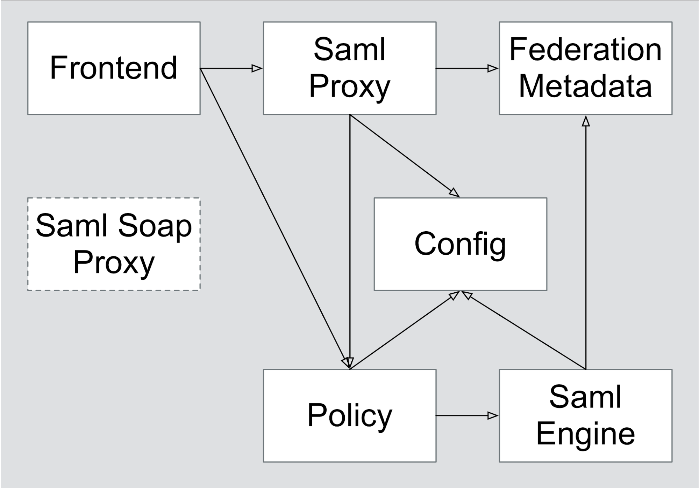

# GOV.UK Verify Hub - Technical overview

## Role of the Hub

GOV.UK Verify provides a central infrastructure, known
as the ‘Hub’ to manage interactions between users, government services
and ‘certified companies’ who can verify users’ identities. Certified
companies, also known as the identity providers or IDPs, are
organisations that have met government and industry standards to provide
identity assurance services as part of GOV.UK Verify. 

The Hub is at the centre of the GOV.UK Verify
federation, providing a clear divide between government services and
certified companies. Government services and certified companies that
join the federation only need to integrate with the Hub rather than the
full
federation.

When a user tries to access a service connected to
Verify:

1.  The service sends them to the GOV.UK Verify
    Hub.
2.  The Hub sends them to a certified company.
3.  The certified company sends them back to the
    Hub.
4.  The Hub sends them back to the service.

This approach means:
  - users’ data isn’t stored in one place
  - services don’t know which certified company the
    user chooses
  - certified companies don’t know which government
    service the user is trying to access

## Technical features

The Hub has been built to be compliant with the
Identity Assurance Hub Service SAML v2.0
Profile.

The Hub does not rely on any long-term state, which
means it does not store any part of the message exchange any longer than
a single session (up to 90 minutes).

The Hub ensures the certified company provides the
Level of Assurance (LOA) required to meet the needs of the requesting
service.

The Hub enforces additional layers of security on top
of those provided by SAML through the use of a Public Key Infrastructure
(PKI) and extensions. 

GOV.UK Verify uses a PKI to issue certificates for use within the Verify
federation. Each role in the federation is
linked to an independent Certificate Authority (CA) and intermediary
X509 certificate. For example, the Hub will enforce that SAML messages
provided by an IDP are signed using a private key associated with a X509
certificate issued from the IDP CA. 

The Hub introduces a concept known as end-to-end trust where the Hub does not
directly assert identity data. It does this by propagating untampered assertions
between the certificate company and government service.

For most UK government services, the Hub orchestrates
[matching identity data](https://alphagov.github.io/rp-onboarding-tech-docs/pages/matching/matching.html) using
back-channel communication to service or organisation-level matching
services.

## Hub services

The GOV.UK Verify team developed the Hub following
Service Oriented Architecture (SOA) using principles borrowed from the
concept of microservices and HTTP APIs.

The Hub is composed of a series of services with one or
more services providing the functionality required to implement the
Identity Assurance Hub Service SAML v2.0 Profile. The Hub is structured
to separate responsibilities and to harden the system against certain
kinds of attack. Components are independently
deployable and are kept in independent code repositories published in
the open.

The Hub also hosts a signed SAML metadata document,
known as the federation metadata, that provides:
  - the Hub’s SAML metadata (including signing and
    encryption certificates and assertion consumer service URI)
  - each certified
    company’s SAML
    metadata (including signing certificates and Single Sign-On
    location)

Diagram: Services and communication within the GOV.UK Verify Hub.

The Hub contains 6 core services:
  - [Frontend](#frontend)
  - [Saml-Proxy](#saml-proxy)
  - [Saml-Soap-Proxy](#saml-soap-proxy)
  - [Policy](#policy)
  - [Saml-Engine](#saml-engine)
  - [Config](#config)

All of the Hub services, except for the frontend, are
Java applications and use the Dropwizard framework. 
The frontend is a Ruby on Rails application.

### Frontend

Frontend provides the presentation layer of the Hub.
It handle a user’s browser requests and provides appropriate responses as
expected of a web service. 
It is the only core service that can be accessed externally.

The frontend can be found [here](https://github.com/alphagov/verify-frontend/).

### Saml-Proxy

This service provides the Hub with an early line of defence against some attacks
commonly used against SAML products.
It performs basic XML and signature validation on all incoming and outgoing SAML
messages.
This provides some mitigation against attacks that could result in private key
exposure.

A README for the saml-proxy is avaialble
[here](https://github.com/alphagov/verify-hub/blob/master/hub/saml-proxy/README.md).

### Saml-Soap-Proxy

This service handles the dispatch of matching requests between the Hub and
government services.
It is not used when exchanging identities to other countries.

A README for the saml-soap-proxy is avaialble
[here](https://github.com/alphagov/verify-hub/blob/master/hub/saml-soap-proxy/README.md).

### Policy

The Policy service provides a state machine that ensures a user can only make
the actions available at each stage of the Hub user journey. 

Policy implements a distributed session cache shared between all instances of
the service. 

Policy also ensures that an internal audit service receives a message for each
business event that occurs.

A README for the policy is avaialble
[here](https://github.com/alphagov/verify-hub/blob/master/hub/policy/README.md).

### Saml-Engine

The Saml-Engine service is responsible for processing all inbound SAML messages
and generating all outbound SAML messages.

Saml-Engine expects to receive and will provide SAML messages as properties
within a JSON body. 

When processing an inbound SAML message, Saml-Engine will validate and decrypt
its content where appropriate. 
Assertions decrypted by the service are validated then encrypted for the
government service to receive.

Saml-Engine implements replay attack prevention on both received assertions and
AuthN requests.
This is implemented using a distributed data store shared across all instances
of Saml-Engine.

When Saml-Engine generates new SAML messages it must sign the messages using
the Hub’s private signing keys. When Saml-Engine processes inbound SAML messages
it may also need to decrypt assertions use the Hub’s private encryption key.
These keys are treated so that only Saml-Engine is able to access them.

A README for the saml-engine is avaialble
[here](https://github.com/alphagov/verify-hub/blob/master/hub/saml-engine/README.md).

### Config

The Config service hosts some of the metadata of the
Verify federation that is needed by other Hub services.

It provides metadata of:

  - government services (including X509 certificates,
    relevant URIs, required levels of assurance, and content required
    for the user journey)
  - certified companies (including supported levels of
    assurance and content required for the user journey)

A README for the config is avaialble
[here](https://github.com/alphagov/verify-hub/blob/master/hub/config/README.md).

## Infrastructure

The Hub is hosted on Amazon Web Services with services
deployed as EC2 instances running Ubuntu.

The Hub service is split into two zones: an internet
facing zone known as the ‘DMZ’ and a non-internet-facing zone accessible
by services in the ‘DMZ’ known as ‘protected’.

The Hub doesn’t rely on a persistent data store but
Policy and Saml-Engine make use of the Infinispan distributed data store for
maintaining consistent session state.

### Audit capability

The GOV.UK Verify programme also operates an audit
service alongside the Hub. The audit service is deployed independently
of the Hub in its own AWS infrastructure.

The hub services, primarily Policy, interact with the
audit service through the dispatch of events, associated to a user’s
journey through the hub, as HTTP requests where they are published to a
database on AWS. If the dispatch of an event to the audit service fails
then the user journey will be terminated.
